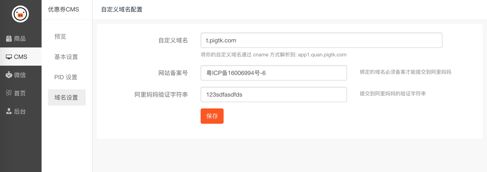

# 绑定域名

## 添加域名

前提是你要有一个自己的域名。

如果已购买了域名并且备案。就可以前往你的域名管理平台（你域名在哪儿买的就是在哪儿管理，如果实在不知道怎么管理，请咨询你购买域名的网站的客服）。配置一条CNAME 记录到系统分配给你的3级域名上面。

填上备案号，提交即可。

## 阿里妈妈验证字符串如何填写？

上一步完成后，前往阿里妈妈平台，提交网站。[参考这里的教程](../taobaoke/taodianjin_pid.md)
