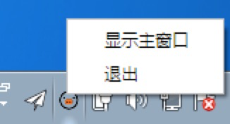

# 常见问题

对于用户的问题，会不定期的更新这里，点击下面的目录可跳转。

<!-- toc -->

## 小猪淘客助手需要运行吗?

在使用小猪淘客系列软件期间（CMS系统、微信机器人、小程序），都必须运行小猪淘客助手软件。

---

## 小猪淘客助手如何退出?

小猪淘客助手运行后会在电脑右下角的通知区有个图标，在图标上点右键，选择退出菜单。

---

## 下单后联盟没有显示订单?

请检查你的后台 PID 的配置。如果 PID 填错，是无法获得佣金的。
另外，联盟也不会统计自己推广的订单。（自推自买）

---

## 如何避免微信号被封？

目前没有能够完全规避微信封号的办法，所有策略都只能降低封号的风险。

- 推荐使用小号发送，大号做群主，这样一旦被封也不会有太大损失。
- 新号、小号，请使用机器人挂机7天以上，再开始用会更加稳妥。
- 机器人号码绑定手机、邮箱，一旦出现冻结、被盗都措施都可以找回、改密等，做好防范措施。
- 降低发送频率，增加群内互动，引导用户主动找券。

---
