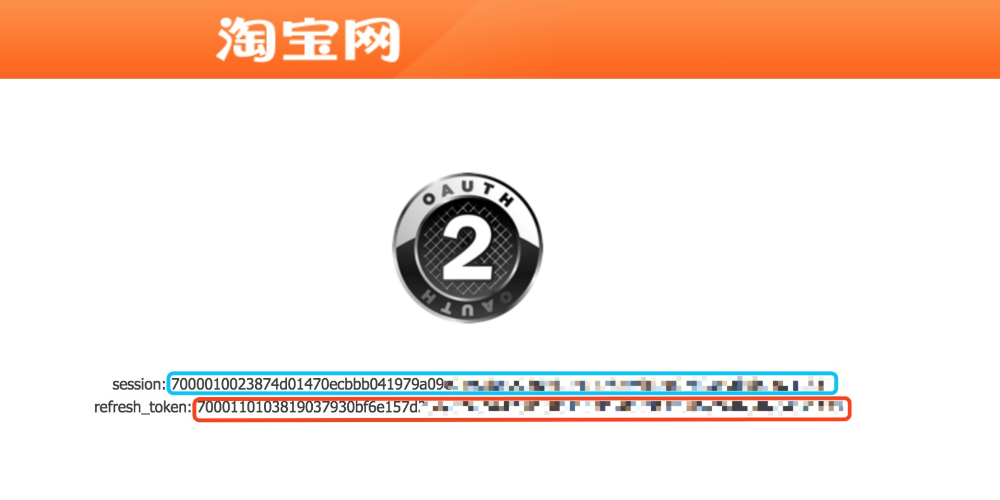

# 获取淘宝高佣授权

## 授权步骤

* 点击链接跳转到 [授权页面](https://oauth.taobao.com/authorize?response_type=token&client_id=23196777&state=1212&view=web "淘宝授权")
* 登录淘宝账号
* 分别复制 `session` 和 `refresh_token` 填写到后台。

上图红色框中部分为 session, 蓝色框中部分为 refresh_token

## 授权有效期

正常授权的有效期为 1 个月，但中途有可能会失效。

## 必须注意

* 确保小猪后台配置的 `pid` 都属于授权的淘宝账号。如果授权 `session` 和 `pid` 不匹配将会导致 **无法申请高佣**。
* 一个淘宝账号只能授权一个工具。

## 授权何时失效

* 如果你在小猪平台授权后，再去其他工具授权，会立即使小猪这边的高佣授权 `session` 失效。
* 如果2次点击授权链接，第2次授权成功后会使之前的授权 `session` 失效。
* 非正常情况下授权失效。
* 超过30天有效期。

## 如果授权失效会怎样

如果授权 `session` 失效，将会无法自动申请高俑。

## 正确的做法

* 只在此处授权，不要同时授权其他的软件（或者使用其他的淘宝账号分别授权不同的软件）。
* 定时查看后台的授权状态，确保授权正常。
