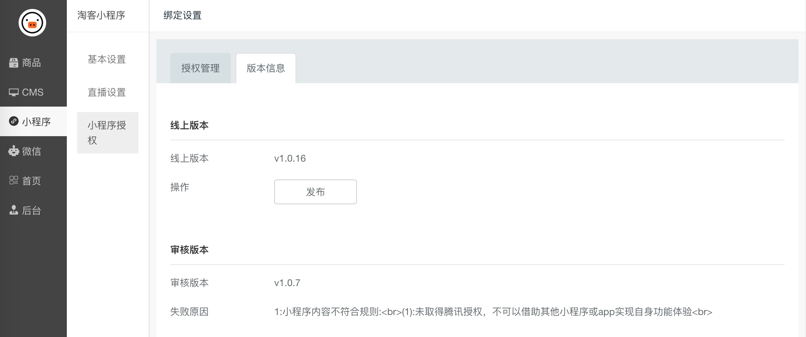
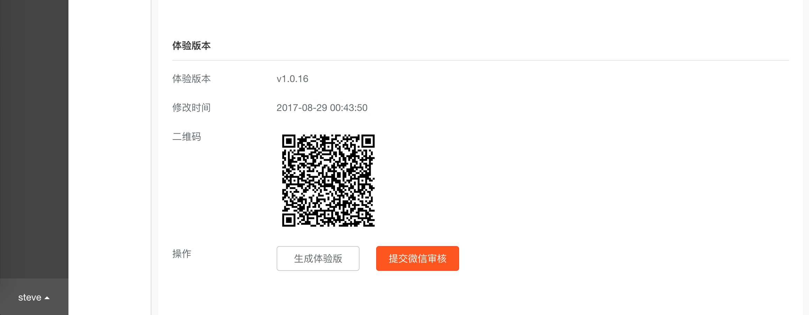
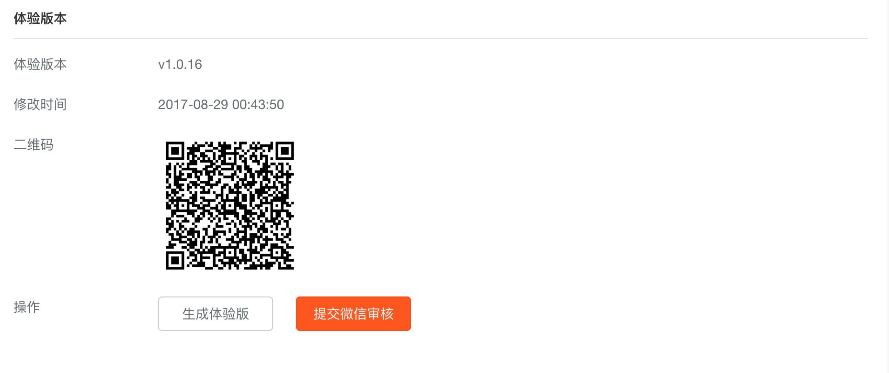
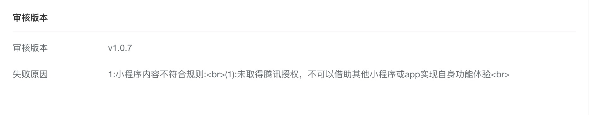
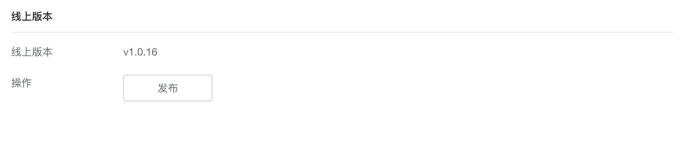

# 发布小程序

**发布流程：**

非常重要，请严格按照此流程操作。

> 生成体验版 > 提交审核 > 审核通过 > 发布

## 生成体验版

点击 生成体验版 按钮即可生成。

## 提交审核

一定要亲自用微信扫码测试体验版，确认无任何问题之后在提交。如果有问题请联系我。
点击上图的 提交微信审核按钮，可将体验版提交审核。

审核中的版本会显示在上图的位置，如果失败，同样会显示审核失败的原因。

## 发布

审核通过的版本，会显示在上图的位置，同时会出现发布按钮。

点击发布按钮，即可将小程序公开发布。之后，其他人就能使用你的小程序了。
