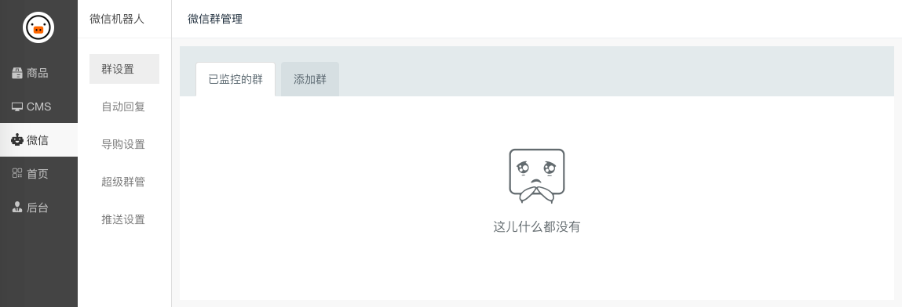

小猪后台配置
======

**配置项说明：**

* 群设置

    只你要监控的微信群，未添加到这里的微信群机器人不会进行监控。

* 自动回复

    设置一些关键词，当群里的用户发送了配置的关键词时，机器人能按照配置做出相应的回复。

* 导购设置

    配置机器人的导购功能，实现自动帮用户找商品。

* 群管配置

    新版机器人不在提供群管功能。因为我们推荐使用不是群主的小号来发单，因此并不具备群管的权限。

* 推送设置

    配置机器人想微信群里发单的规则。
