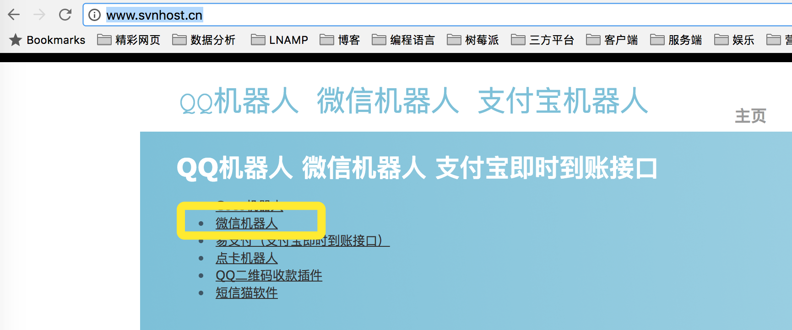
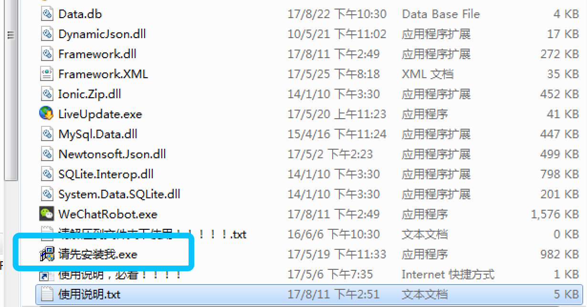
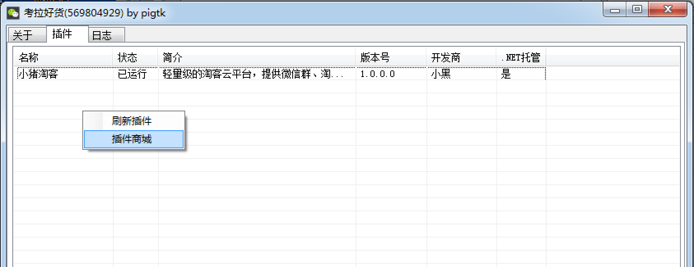
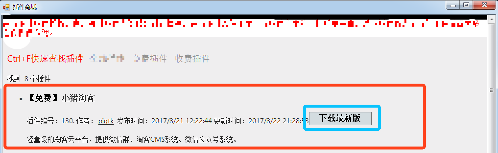
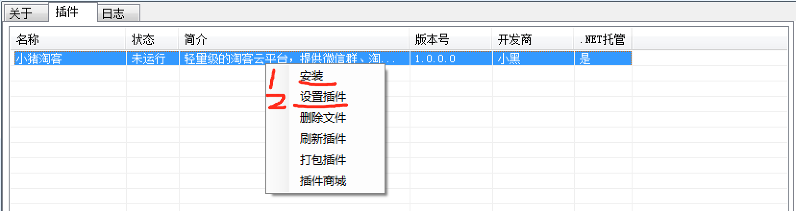
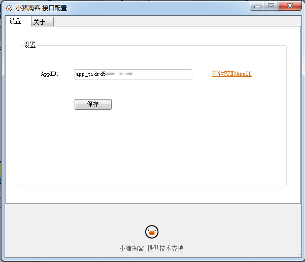

# CoCo微信机器人

## 写在前面

新版小猪机器人为什么不再内置微信功能而是使用CoCo机器人呢。之所以这么做，是有着诸多的考虑。追主要的是，精力十分有限，而微信协议复杂且经常变化，如果要保证机器人稳定运行必须投入相当大的时间来研究跟进研究微信协议。

但是，这真是必要的吗？深思熟虑之后，在当前开发资源有限的情况下，这其实不是必须的。好在，CoCo微信机器人是一个很棒的软件，我亲自测试过，运行非常稳定（支持掉线自动重新登录）。

接下来，小猪可以不必操心微信机器人的事了，可以将精力集中在我们自己的产品上，努力为大家提供一个好用的淘客平台。

## coco机器人的价格

没错，CoCo机器人是收费软件。每个微信号可以免费试用1天（可以换账号继续试用），之后需要购买才能继续试用，费用是每月 15 元（费用由CoCo直接收取）。

## 安装

coco机器人官网：<http://www.svnhost.cn/>

从CoCo机器人官网下载 CoCo微信机器人。解压后，先运行里面的 `请先安装我.exe` 文件。

之后，运行 `WeChatRobot.exe` 启动机器人。使用微信扫码登录。

在 插件 页面，点右键，选择插件商城，打开商城的页面。

打开后，我们选择 小猪淘客插件，点击右侧的 下载最新版按钮。

之后，我们回到插件页面，在小猪淘客插件上面点右键，先选择安装。 在弹出的页面上填入充小猪后台获取的 appkey（如下图），点击保存即可。

微信机器人配置完成了，非常简单。记得每天从插件商城页面下载最新版的小猪淘客插件哦。

**注意：除了使用 小猪淘客 插件外，不要使用其他任何插件。通常消息只能由一个插件来处理，其他插件拦截了小猪就无法正常工作。并且且，小猪不会对启用其他插件造成机器人无法工作的情况提供技术支持。**
