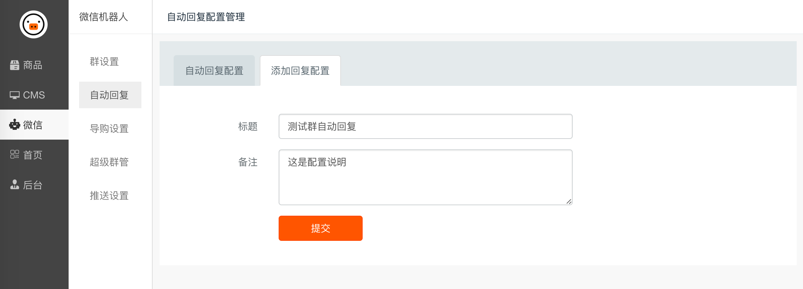
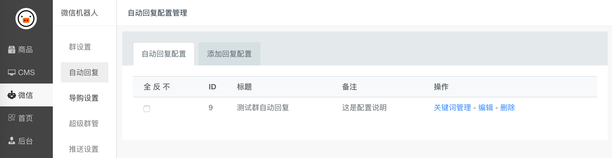
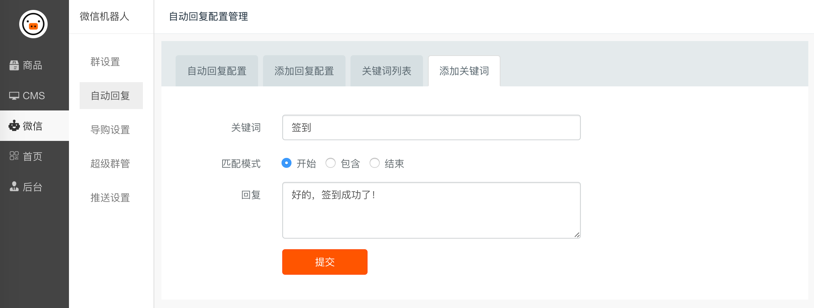
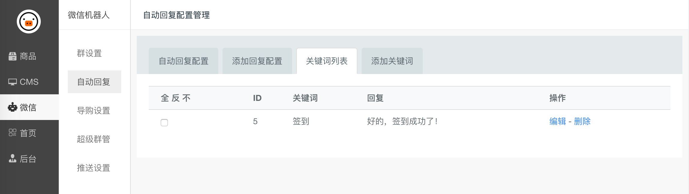

自动回复配置
======

## 添加回复配置

填好表单后点击「提交」按钮。

## 配置关键词

点击「关键词配置」链接，进入关键词管理页面。

点击 「添加关键词」选项卡。填写关键词配置项后点击「提交」按钮。

**配置模式解释:**

- **开始:** 关键词在用户发送的消息最前面时匹配。消息 `签到啦` 会匹配到。

- **包含:** 只要用户发送的消息中包含关键词就匹配，不管关键词在消息中的位置。消息 `签到啦`、`你今天签到了吗`、`快去签到` 都会匹配。

- **结束:** 关键词在用户发送的消息结尾时匹配。消息`快去签到`会匹配。

上图即为关键词回复的效果。

## 管理关键词

关键词列表」 页面可以管理关键词。
