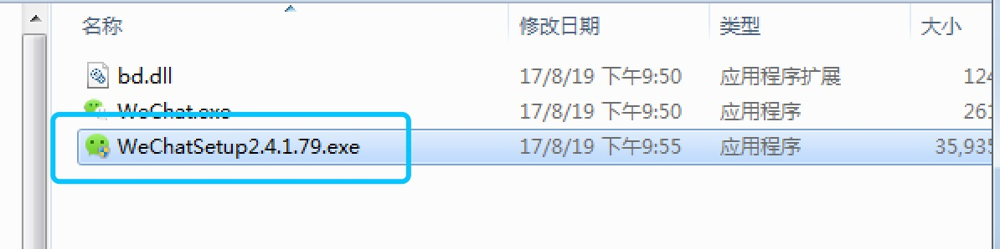
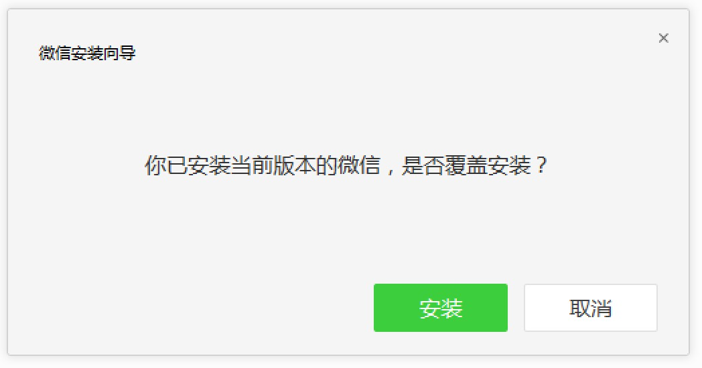
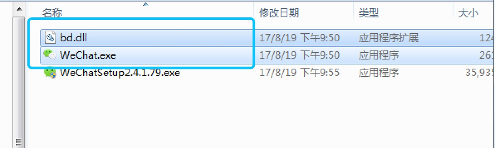
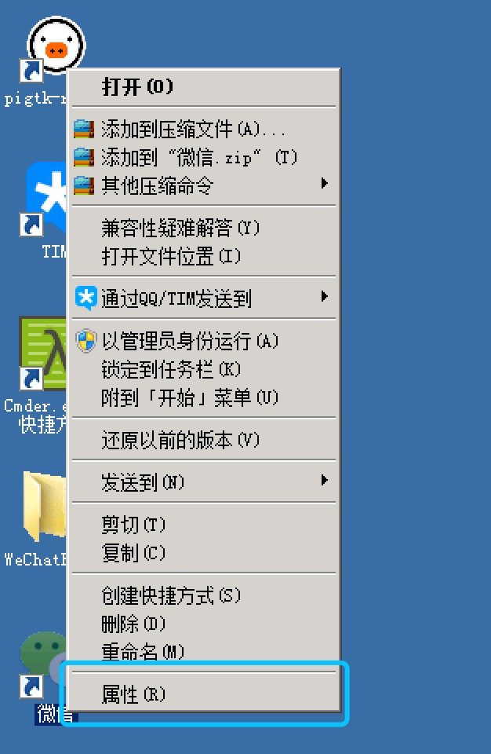
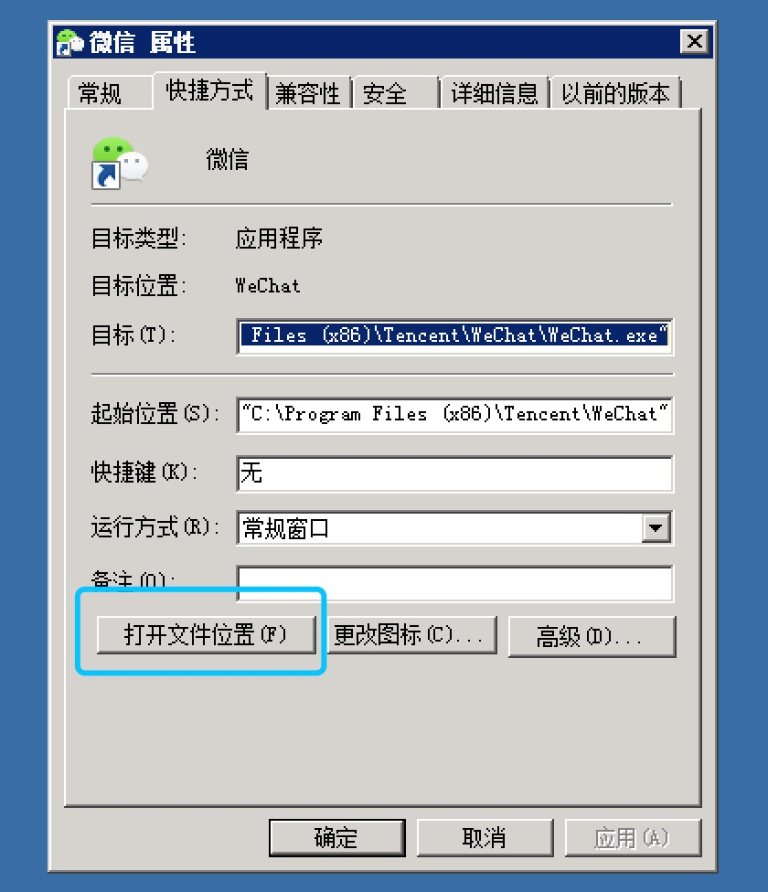
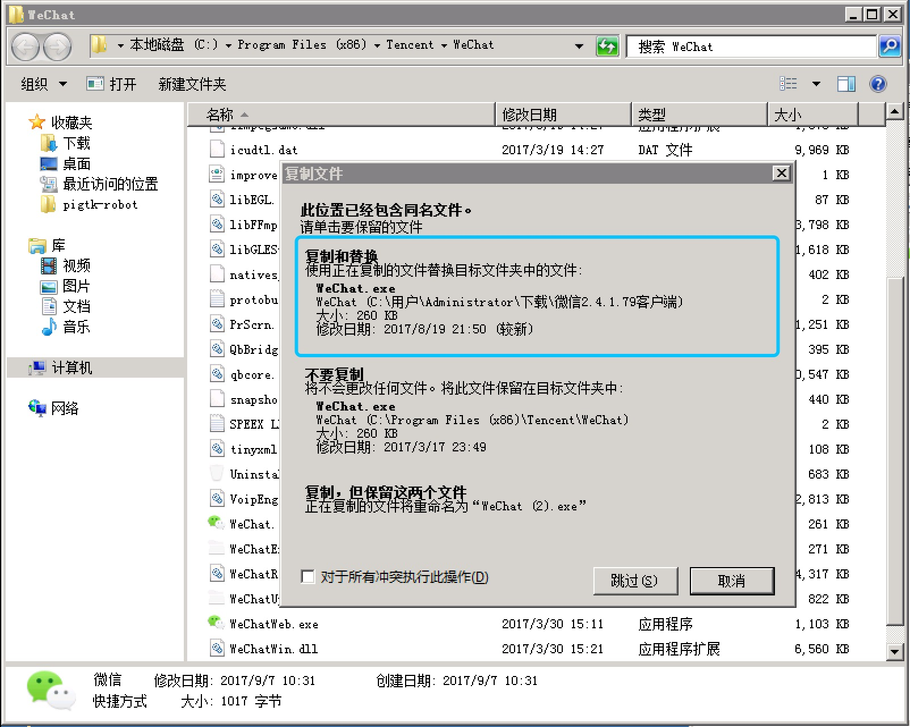
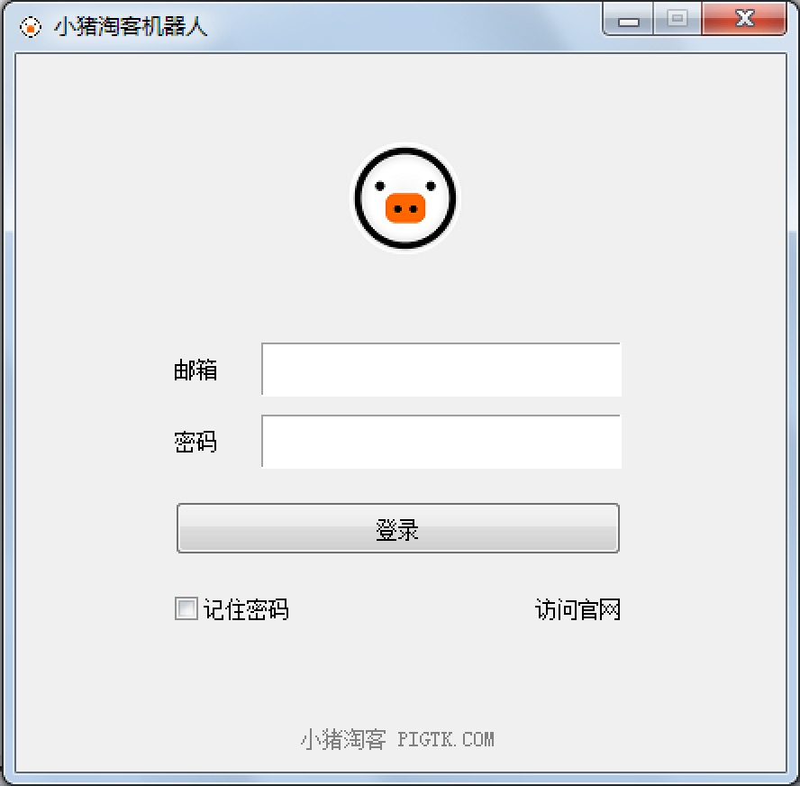
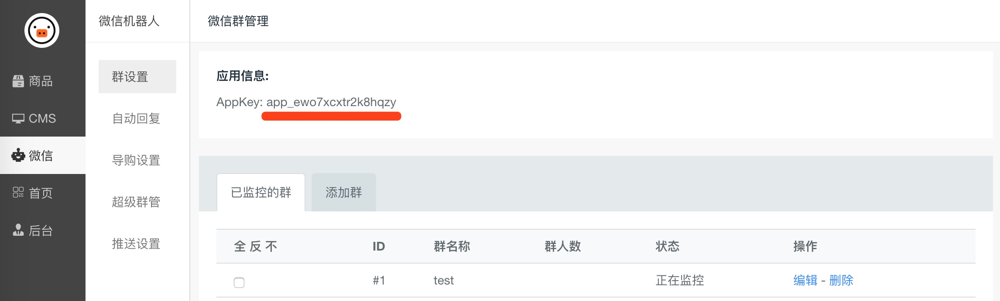

# 小猪淘客微信群机器人

小猪微信机器人 **必须** 保持运行，才能工作。

## 下载微信pc客户端

由于小猪机器人 **只能依赖特定版本** 的微信电脑客户端运行。所以在运行机器人之前需要做一下操作：

1. 退出正在运行的微信。**卸载** 电脑上的微信客户端。

2. [点击这里的链接，下载 2.4.1.79 版本的微信客户端](http://cdn.pigtk.com/robot/微信2.4.1.79客户端.zip)

3. 解压安装包，并进入 `微信2.4.1.79客户端` 文件夹

4. 双击 `WeChatSetup2.4.1.79.exe` 进行安装，如下图：。
  

  如果提示 覆盖安装，请点击 安装按钮，如下图：
  

5. 再次，退出正在运行的微信。

6. 选择 `bd.dll` 和 `WeChat.exe` ，按 `ctrl + c` 复制，如下图：
  

  回到桌面，在微信图标上面，点击**鼠标右键**，选择 `属性`，如下图：
  

  在打开的界面上，选择 `打开文件位置`, 如下图：
  

  之后，在打开的文件夹里面，按 `ctrl + v` 粘贴前面复制的2个文件，选择 `复制并覆盖` 如下图：
  

## 下载小猪淘客机器人

前往小猪官网，下砸小猪淘客机器人。 <http://www.pigtk.com/weixinqun>

## 安装小猪淘客机器人

运行 step.exe，小猪淘客机器人将会自动安装并创建桌面的快捷方式。

## 启动机器人

双击里面的 `小猪淘客机器人.exe` 即可启动。

## 设置

1. 使用你在小猪官网注册的账号登录机器人，如下图：

  

2. 在界面上填入从小猪后台获取的 appkey，点击保存，如下图：

  

3. 点击 `启动微信` 按钮，机器人会启动电脑的微信客户端，扫码登录即可。
