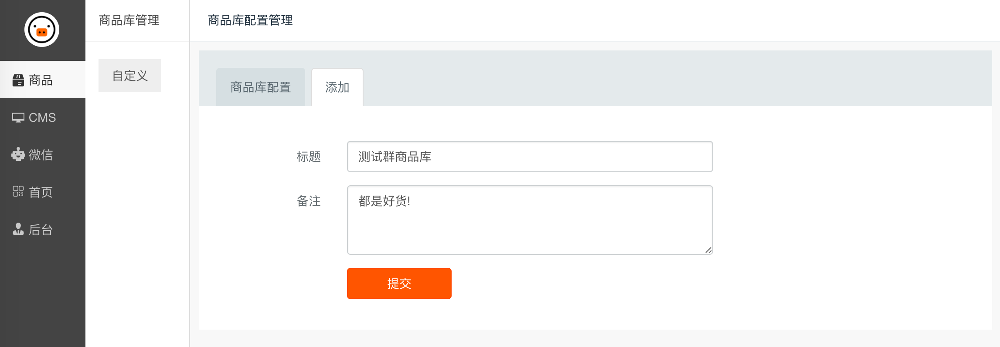
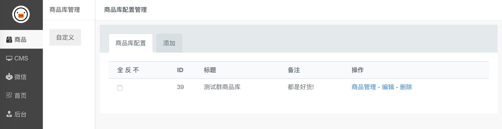
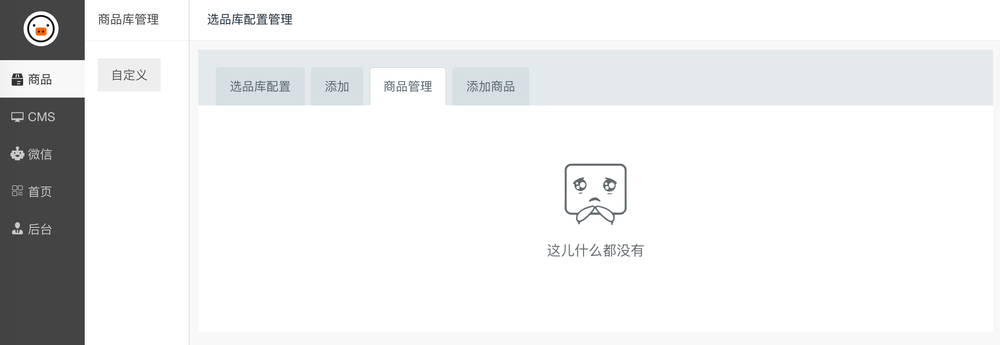
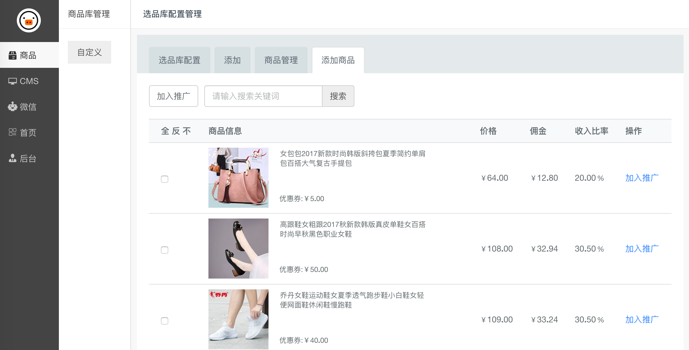
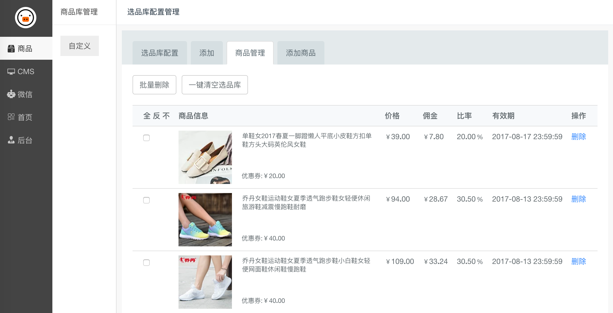

推送设置
======

在配置推送功能之前，需要先配置商品库。

**商品库:**

- 自动采集商品库:
    由小猪系统自动采集、自动维护。
    
- 自定义商品库:
    有你自己创建，从系统自动采集商品库中选择商品，需要你每日维护，确保商品是有效的。

## 配置商品库

### 创建商品库

注意左侧的菜单，是在**商品**类目下。

填好配置项后点击「提交」按钮。

### 管理商品库

在「商品库配置」可以对商品库进行管理。

### 添加商品

点击列表中的「商品管理」链接，即可进入商品管理页面了，默认是没有商品的。

点击 「添加商品」标签，可从系统商品采集库添加商品到自己的商品库。

点击右侧的 「加入推广」链接，即可将商品加入到商品库了。

**提醒**
这里展示的商品的优惠券都是有效的，但是优惠券都有过期时间的。因此，你需要每天维护自己的商品库。

### 管理商品

加入到推广的商品，就能在「商品管理」进行管理了。

## 配置机器人推送

配置好商品库后，来配置机器人的推送配置了。

